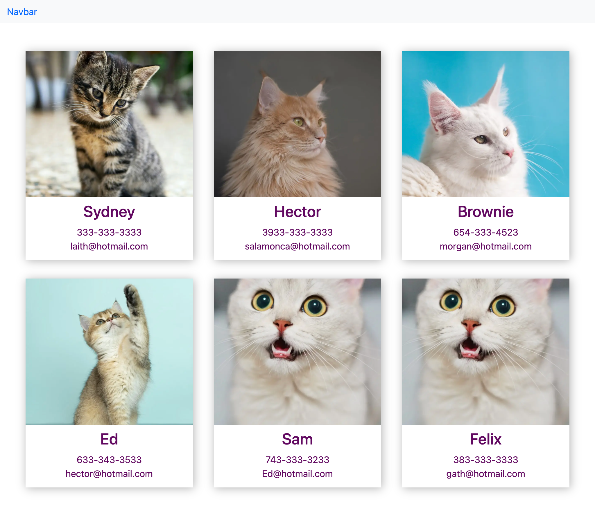

<h1> Myfirst-NEXT.js</h1>

<h4>CreatedAt:17th Dec 2021</h4> 

## Detail of the project

This project is NEXT.js Crash Course in Youtube.

Next.js Crash Course: Laith Harb
https://www.youtube.com/watch?v=6HTs8HtZMt0

## Screen Shot

## Purpose of the project

Get the knowledge of Next.js Fundamentals

## Demo

https://myfirst-next-js-lemon.vercel.app/

## What did I learn from this project?

Next.js Fundamentals

How to install Next.js

How to use Next.js

How to use Next.js with Bootstrap

How to deploy Next.js app to Vercel

## Impressions

It is my first Next.js project.

Already I know React.js and I am familiar with it.
So, why am I study Next.js?

Because, in the near future, I think Next.js will take the place of React.js.
(Or, React.js will evolve from just frontend library to full stack library.)

And, today, it is good timing for learning Next.js for me.

Thank you for reading. And, happy coding!!!
